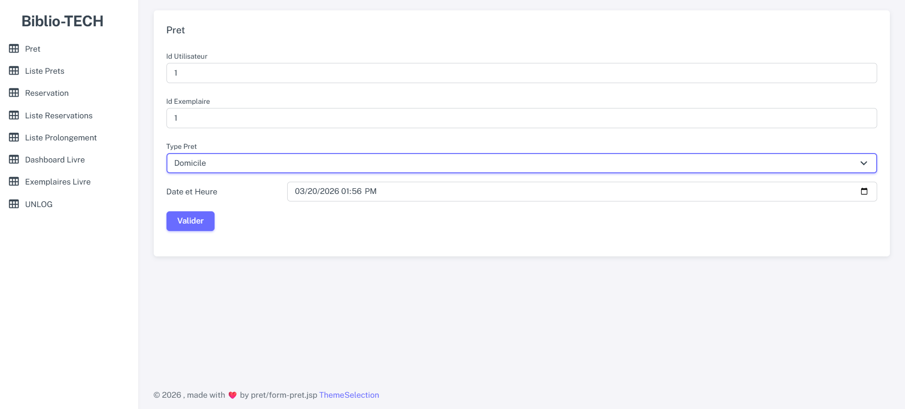
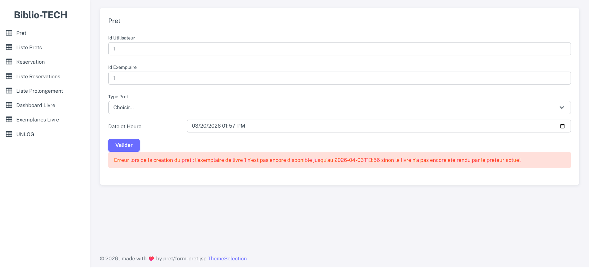
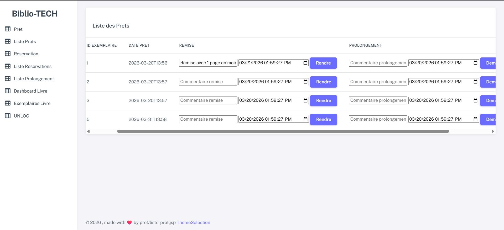
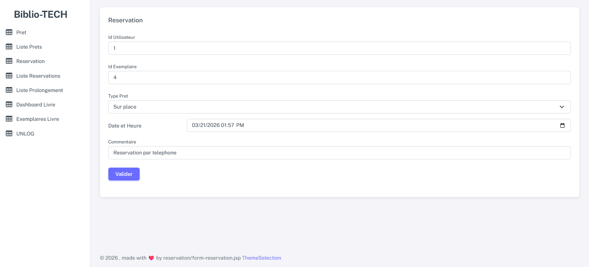
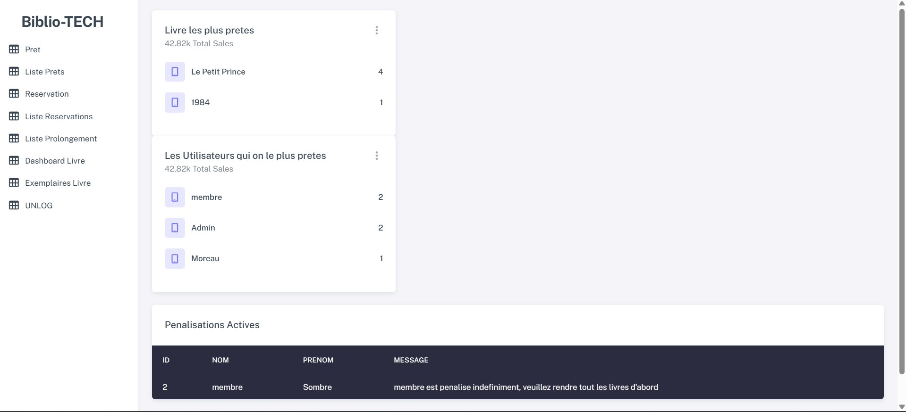

# BIBLIOTECH
### Library Management System — Java Spring MVC · Hibernate JPA · MySQL

> A full-stack web application for managing library operations: loans, reservations, memberships, penalties, and loan extensions — built with a clean layered architecture and strict business rule enforcement.

---

## Tech Stack

| Layer | Technology |
|---|---|
| **Backend Framework** | Spring MVC 6.1.3 |
| **ORM / Persistence** | Hibernate 6.4.4 + Spring Data JPA |
| **Database** | MySQL 8 |
| **Runtime** | Apache Tomcat 10.1.28 (Jakarta EE) |
| **Build Tool** | Maven |
| **Serialization** | Jackson 2.16 (JSON + JSR310) |
| **Java Version** | Java 17 |

---

## Architecture

The project follows a strict **layered architecture**:

```
Presentation   →   Controller (Spring MVC) + JSP Views
Service        →   Business logic, transaction management
Repository     →   Spring Data JPA interfaces (no boilerplate)
Persistence    →   JPA Entities (Hibernate), MySQL views
```

**Configuration approach:** XML-based Spring context (`spring.xml`) combined with annotation scanning (`@Service`, `@Repository`, `@Component`), giving explicit control over infrastructure beans (DataSource, EntityManagerFactory, TransactionManager) while keeping domain code annotation-driven.

---

## Key Features

### Back Office (Bibliothécaire)
- **Loan management** — Create loans with full business rule validation (quota, penalty status, availability, membership coverage)
- **Book return** — Process returns with a configurable return date
- **Reservation** — Reserve a specific copy for a future date, with automatic conversion to a loan on the reservation date
- **Reservation validation** — Approve or reject reservations; approved reservations trigger automatic loan insertion
- **Loan extension** — Request and validate extensions; approved extensions auto-create a new loan chained to the current one
- **Member registration** — Register members with type-based access rules (Student, Professional, Teacher, Anonymous)
- **Dashboard** — Most borrowed books, monthly loan chart, list of currently penalized members

### Front Office (Membre)
- Browse available books and catalogue

### Cross-cutting
- **Session-based authentication** with role separation (admin / standard user) enforced by a Servlet `Filter`
- **Business rule engine** fully driven by the `pret_parametre` database view, which centralizes all loan configuration per member type, loan type, and book genre

---

## Business Rule Highlights

The system enforces rules that make this more than a basic CRUD app:

- **Availability check**: a copy is considered unavailable until it has been physically returned (tracked via the `remise_livre` table), not just by loan date
- **Quota management**: concurrent loan limits per member type and loan type, verified at any given date
- **Penalty system**: overdue returns block all future loans for a configurable number of days
- **Public holiday & weekend handling**: return deadlines shift to the nearest valid working day (configurable direction: before or after)
- **Reservation integrity**: a reservation auto-cancels if not collected by the day after its date
- **Extension chaining**: a validated extension creates a new loan starting exactly at the end of the current one, with an automatic early-return one hour before to avoid triggering penalty rules

---

## ORM & Performance Notes

- **Relationship mapping**: `@OneToMany`, `@ManyToOne`, `@ManyToMany` with join table entities using `@EmbeddedId`
- **N+1 problem mitigation**: `FetchType.LAZY` used by default; collections are explicitly initialized inside `@Transactional` service methods when needed
- **Custom projections**: DTO-based results via JPQL and native queries for dashboard aggregations (e.g., `LivreNombreDTO` for loan counts)
- **Database views**: complex availability and parameter queries are encapsulated in MySQL views (`pret_parametre`, `exemplaire_disponible`, `pret_nombre_desc`) and mapped as read-only entities

---

## Screenshots










---

## Project Structure

```
src/
├── main/
│   ├── java/com/
│   │   ├── Controller/       # Spring MVC controllers
│   │   ├── Service/          # Business logic + @Transactional
│   │   ├── Repository/       # Spring Data JPA interfaces
│   │   ├── Entite/           # JPA entities + DTOs
│   │   └── Filters/          # AuthFilter (session-based auth)
│   ├── resources/
│   │   └── spring.xml        # Spring application context
│   └── webapp/
│       ├── WEB-INF/
│       │   ├── web.xml
│       │   ├── dispatcher-servlet.xml
│       │   └── views/        # JSP pages
│       ├── css/
│       ├── js/
│       └── images/
└── sql/
    ├── final.sql             # Full schema + seed data + cross data
    ├── data.sql              # Sample operational data
    └── query.sql             # Standalone test queries
```

---

## Running the Project

### Prerequisites
- Java 17
- Apache Tomcat 10.1.28
- MySQL 8
- Maven 3.x

### 1 — Database Setup

```sql
-- Run the full setup script (schema + data + parameters)
SOURCE path/to/final.sql;
```

### 2 — Configure the Project

**`src/main/resources/spring.xml`** — update the datasource:
```xml
<property name="url" value="jdbc:mysql://localhost:3306/bibliotech?useSSL=false&amp;serverTimezone=UTC"/>
<property name="username" value="YOUR_USERNAME"/>
<property name="password" value="YOUR_PASSWORD"/>
```

**`pom.xml`** — update the Tomcat deployment path:
```xml
<tomcat.webapps.dir>PATH_TO_YOUR_TOMCAT/webapps</tomcat.webapps.dir>
```

### 3 — Build & Deploy

```bash
mvn clean package
```

The `maven-antrun-plugin` automatically copies the generated WAR to the configured Tomcat `webapps` directory.

### 4 — Start Tomcat

```bash
# Linux / macOS
$CATALINA_HOME/bin/startup.sh

# Windows
%CATALINA_HOME%\bin\startup.bat
```

Access the app at: `http://localhost:8080/Bibliotech`

> **Note:** The project targets Tomcat 10.1.x specifically (Jakarta EE namespace). It is **not** compatible with Tomcat 9.x or earlier (which use the `javax.*` namespace).

---

## Authentication

Authentication is handled by a custom `AuthFilter` registered in `web.xml`. On every request:

1. Static resources and public paths (`/user/login`, `/public/*`) bypass the filter
2. The filter reads a `auth` session attribute containing the authenticated user's ID
3. Users with `typeUser.id != 1` are redirected to the public-facing front office
4. Invalid or expired sessions are invalidated and redirected to the login page

---

## Development Log (Selected Milestones)

| Date | Milestone |
|---|---|
| May 2025 | Project initialization: Spring bean configuration, dependency injection, XML context setup |
| May 2025 | Migrated from manual DAO pattern to Spring Data JPA repositories |
| May 2025 | Implemented full Spring MVC layer: controllers, dispatcher servlet, JSP views |
| May 2025 | Resolved Jakarta/javax namespace conflict between Spring 6 and Tomcat 10 |
| May 2025 | Full CRUD implemented for core entities with layered architecture |
| Jul 1 2025 | BIBLIOTECH project start: database initialization, loan availability logic via SQL views |
| Jul 4 2025 | `pret_parametre` view mapped as entity; loan parameter resolution finalized |
| Jul 5 2025 | Book return, reservation, and reservation validation features completed |
| Jul 6 2025 | On-site loan same-day deadline fix (cutoff at 20:00); availability detection from return records |
| Jul 10 2025 | `LivreNombreDTO` projection issue resolved via dedicated SQL view; reservation validation tested |
| Jul 12 2025 | Fixed race condition: reservation validated after a same-day walk-in loan incorrectly created a duplicate loan; root cause was timestamp comparison precision |
| Jul 14 2025 | Loan extension request feature implemented |
| Jul 15 2025 | Extension validation: auto-return chaining, new loan insertion at exact end-of-current-loan date |

---

## Known Limitations & Future Work

- Cancelling an already-validated reservation requires additional state machine logic (not yet implemented)
- The `created_at` timestamp field on some entities is not yet leveraged in business logic
- Age-based configuration (`config age`) planned but not implemented
- Extension availability check (rule 3 in UC-6) is currently suspended: since unreturned copies cannot be re-lent, the check is redundant and has been disabled pending review

---

## About

This project was built as a comprehensive portfolio piece to demonstrate production-level Java backend skills:

- Designing and implementing a non-trivial domain model with interdependent business rules
- Configuring a full Spring MVC + Hibernate stack from scratch (no Spring Boot)
- Writing and optimizing SQL views for complex multi-table queries
- Managing transactional consistency across multiple related entities
- Structuring a maintainable layered codebase ready for team collaboration

---

*Available for Java freelance missions — backend, API design, Spring ecosystem.*
